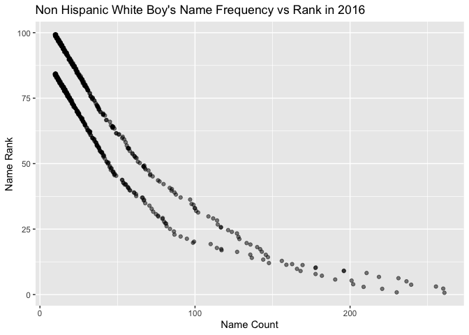

HW2
================
Gunnar
10/3/2021

Loading libraries

``` r
library(tidyverse)
library(janitor)
library(readxl)
```

**Problem 1** Part 1. Loading Mr. Trash Wheel dataset filtering out row
totals cleaning variable names and removing unnecssary variables
rounding sport balls to the nearest integer

``` r
library(readxl)
df <- read_excel("working data/Trash-Wheel-Collection-Totals-7-2020-2.xlsx", sheet = "Mr. Trash Wheel")

df <- df %>%
  filter(!endsWith(Month, "Total")) %>%
  clean_names() %>%
  select(-x15, -x16, -x17) %>%
  mutate(sports_balls = round(sports_balls))

df %>%
  nrow()
```

    ## [1] 453

``` r
df %>%
  pull(sports_balls) %>%
  head()
```

    ## [1] 7 5 6 6 7 5

``` r
df %>%
  group_by(year) %>%
  summarize(mean(chip_bags))
```

    ## # A tibble: 8 × 2
    ##    year `mean(chip_bags)`
    ##   <dbl>             <dbl>
    ## 1  2014             1610.
    ## 2  2015             1849.
    ## 3  2016             2752.
    ## 4  2017             2237.
    ## 5  2018             1279.
    ## 6  2019             1025.
    ## 7  2020              739.
    ## 8  2021              540

Part 2.

Importing 2018 and 2019 data sets. Remove first row of data. Add year
variable to each data frame. Omit rows with missing precipitation data.
Omit total row for each df.

``` r
df_p2019 <- read_excel("working data/Trash-Wheel-Collection-Totals-8-6-19.xlsx", sheet = "2019 Precipitation", skip = 1)

df_p2019 <- df_p2019 %>%
  clean_names %>%
  mutate(year = 2019) %>%
  filter(!is.na(total)) %>%
  filter(!is.na(month))

df_p2018 <- read_excel("working data/Trash-Wheel-Collection-Totals-8-6-19.xlsx", sheet = "2018 Precipitation", skip = 1)  

df_p2018 <- df_p2018 %>%
  clean_names %>%
  mutate(year = 2018) %>%
  filter(!is.na(total)) %>%
  filter(!is.na(month))

df_p_combined <- bind_rows(df_p2018, df_p2019) %>%
  mutate(month = month.name[month])


df_p_combined %>%
  group_by(year) %>%
  summarise(mean(total))
```

    ## # A tibble: 2 × 2
    ##    year `mean(total)`
    ##   <dbl>         <dbl>
    ## 1  2018          5.86
    ## 2  2019          2.78

``` r
nrow(df_p_combined)
```

    ## [1] 18

Part 3.

For the Mr. Trash Wheels data set, there were 344 observations spanning
between 2014 and 2019. In 2015, there was a mean of 1849 chip bags found
in a dumpster while in 2019 there was a mean of only 930.

For the combined precipitation data set, there were 18 observations
throughout 2018 and 2019. In 2018, the mean amount of precipitation was
5.86 inches while the mean amount of precipitation was 2.78 inches in
2019.

**Problem 2** Loading pols-month.csv, unemployment.csv, and snp.csv

``` r
pols_df <- read_csv("working data/fivethirtyeight_datasets/pols-month.csv")

unemploy_df <- read_csv("working data/fivethirtyeight_datasets/unemployment.csv")

snp_df <- read_csv("working data/fivethirtyeight_datasets/snp.csv")
```

Cleaning pols\_month dataframe

``` r
pols_df <- pols_df %>%
  separate(mon, into = c("year", "month", "day"), sep = "-") %>%
  mutate(month = as.numeric(month)) %>%
  mutate(month = month.name[month]) %>%
  mutate(year = as.numeric(year)) %>%
  mutate(prez = ifelse(prez_gop == 1, "gop", ifelse(prez_dem == 1, "dem", NA))) %>%
  select(-prez_gop, -prez_dem, -day) %>%
  relocate(year, month)


names(pols_df)
```

    ## [1] "year"    "month"   "gov_gop" "sen_gop" "rep_gop" "gov_dem" "sen_dem"
    ## [8] "rep_dem" "prez"

``` r
summary(pols_df)
```

    ##       year         month              gov_gop         sen_gop    
    ##  Min.   :1947   Length:822         Min.   :12.00   Min.   :32.0  
    ##  1st Qu.:1964   Class :character   1st Qu.:18.00   1st Qu.:42.0  
    ##  Median :1981   Mode  :character   Median :22.00   Median :46.0  
    ##  Mean   :1981                      Mean   :22.48   Mean   :46.1  
    ##  3rd Qu.:1998                      3rd Qu.:28.00   3rd Qu.:51.0  
    ##  Max.   :2015                      Max.   :34.00   Max.   :56.0  
    ##     rep_gop         gov_dem        sen_dem         rep_dem   
    ##  Min.   :141.0   Min.   :17.0   Min.   :44.00   Min.   :188  
    ##  1st Qu.:176.0   1st Qu.:22.0   1st Qu.:48.00   1st Qu.:211  
    ##  Median :195.0   Median :28.0   Median :53.00   Median :250  
    ##  Mean   :194.9   Mean   :27.2   Mean   :54.41   Mean   :245  
    ##  3rd Qu.:222.0   3rd Qu.:32.0   3rd Qu.:58.00   3rd Qu.:268  
    ##  Max.   :253.0   Max.   :41.0   Max.   :71.00   Max.   :301  
    ##      prez          
    ##  Length:822        
    ##  Class :character  
    ##  Mode  :character  
    ##                    
    ##                    
    ## 

``` r
head(pols_df$month)
```

    ## [1] "January"  "February" "March"    "April"    "May"      "June"

``` r
nrow(pols_df)
```

    ## [1] 822

Cleaning snp dataframe

``` r
snp_df <- snp_df %>%
  separate(date, into = c("year", "month", "day"), sep = "/") %>%
  mutate(month = as.numeric(month)) %>% 
  mutate(year = as.numeric(year)) %>%
  mutate(month = month.name[month]) %>%
  mutate(year = year + 2000) %>%
  select(-day) %>%
  relocate(year, month)

names(snp_df)
```

    ## [1] "year"  "month" "close"

``` r
summary(snp_df)
```

    ##       year         month               close        
    ##  Min.   :2001   Length:787         Min.   :  17.05  
    ##  1st Qu.:2003   Class :character   1st Qu.:  83.73  
    ##  Median :2006   Mode  :character   Median : 138.53  
    ##  Mean   :2006                      Mean   : 474.89  
    ##  3rd Qu.:2009                      3rd Qu.: 941.79  
    ##  Max.   :2012                      Max.   :2107.39

``` r
head(snp_df$year)
```

    ## [1] 2007 2006 2005 2004 2003 2002

``` r
nrow(snp_df)
```

    ## [1] 787

Cleaning unemployment dataframe

``` r
unemploy_df <- unemploy_df %>%
  clean_names() %>%
  pivot_longer(cols = jan:dec, names_to = "month", values_to = "unemployment") %>%
  mutate(month = factor(month, labels = month.name)) %>%
  select(year, month, unemployment)

names(unemploy_df)
```

    ## [1] "year"         "month"        "unemployment"

``` r
summary(unemploy_df)
```

    ##       year           month      unemployment  
    ##  Min.   :1948   January : 68   Min.   : 2.50  
    ##  1st Qu.:1965   February: 68   1st Qu.: 4.70  
    ##  Median :1982   March   : 68   Median : 5.60  
    ##  Mean   :1982   April   : 68   Mean   : 5.83  
    ##  3rd Qu.:1998   May     : 68   3rd Qu.: 6.90  
    ##  Max.   :2015   June    : 68   Max.   :10.80  
    ##                 (Other) :408   NA's   :6

``` r
nrow(unemploy_df)
```

    ## [1] 816

Merging the data sets

``` r
pols <- left_join(snp_df, pols_df, by = c("year", "month"))
pols <- left_join(pols, unemploy_df)
head(pols)
```

    ## # A tibble: 6 × 11
    ##    year month    close gov_gop sen_gop rep_gop gov_dem sen_dem rep_dem prez 
    ##   <dbl> <chr>    <dbl>   <dbl>   <dbl>   <dbl>   <dbl>   <dbl>   <dbl> <chr>
    ## 1  2007 January  2080.      22      48     201      28      50     233 gop  
    ## 2  2006 January  2063.      28      54     231      22      45     201 gop  
    ## 3  2005 January  2107.      28      54     232      22      45     201 gop  
    ## 4  2004 January  2086.      28      51     229      22      48     203 gop  
    ## 5  2003 February 2068.      26      51     231      24      48     203 gop  
    ## 6  2002 February 2104.      27      50     221      21      50     211 gop  
    ## # … with 1 more variable: unemployment <dbl>

``` r
pols %>%
  group_by(prez) %>%
  summarise(mean(unemployment))
```

    ## # A tibble: 2 × 2
    ##   prez  `mean(unemployment)`
    ##   <chr>                <dbl>
    ## 1 dem                   9.00
    ## 2 gop                   5.28

*Discussion of the data set*

After cleaning the data sets and before merging them, the pols data set
contained 822 observations over 9 variables: year, month, gov\_gop,
sen\_gop, rep\_gop, gov\_dem, sen\_dem, rep\_dem, and prez. The snp data
set, meanwhile, contained 787 observations over 3 variables: year,
month, and close. Lastly, the unemployment data set has 816
observations: year, month, and unemployment level.

In the combined data set, there are 787 observations over 11 variables.
The time range for the combined data set is between 2001 and 2012. An
interesting observation from the data set is that the average
unemployment rate under democratic presidents was 9.00 while it was 5.28
under republican presidents.

**Problem 3**

Loading the baby name data set

``` r
baby_df <- read_csv("working data/Popular_Baby_Names.csv")
```

    ## Rows: 19418 Columns: 6

    ## ── Column specification ────────────────────────────────────────────────────────
    ## Delimiter: ","
    ## chr (3): Gender, Ethnicity, Child's First Name
    ## dbl (3): Year of Birth, Count, Rank

    ## 
    ## ℹ Use `spec()` to retrieve the full column specification for this data.
    ## ℹ Specify the column types or set `show_col_types = FALSE` to quiet this message.

Cleaning the baby name data set First, clean names Second, make all
values lower case Third, merge name versions Fourth, remove all
duplicate rows (based on repeat of name, year, and gender)

``` r
baby_df <- baby_df %>%
  clean_names() %>%
  mutate(gender = tolower(gender), ethnicity = tolower(ethnicity), 
        childs_first_name = tolower(childs_first_name)) %>%
  mutate(ethnicity = ifelse(ethnicity == "asian and paci" | ethnicity == "asian and pacific islander", "asian and pacific islander", ifelse(ethnicity == "white non hispanic" | ethnicity == "white non hisp", "white non hispanic", ifelse(ethnicity == "black non hispanic" | ethnicity == "black non hisp", "black non hispanic", ethnicity)))) %>%
  distinct(childs_first_name, gender, year_of_birth, ethnicity, .keep_all = TRUE)

baby_df %>%
  filter(childs_first_name == "olivia")
```

    ## # A tibble: 24 × 6
    ##    year_of_birth gender ethnicity                  childs_first_name count  rank
    ##            <dbl> <chr>  <chr>                      <chr>             <dbl> <dbl>
    ##  1          2016 female asian and pacific islander olivia              172     1
    ##  2          2016 female black non hispanic         olivia               49     8
    ##  3          2016 female hispanic                   olivia              108    13
    ##  4          2016 female white non hispanic         olivia              230     1
    ##  5          2015 female asian and pacific islander olivia              188     1
    ##  6          2015 female black non hispanic         olivia               82     4
    ##  7          2015 female hispanic                   olivia               94    16
    ##  8          2015 female white non hispanic         olivia              225     1
    ##  9          2014 female asian and pacific islander olivia              141     1
    ## 10          2014 female black non hispanic         olivia               52     8
    ## # … with 14 more rows

Creating table of frequency of name Olivia over time Filter to only
girls named Olivia group by birth year pivot wider so that years are
columns

``` r
olivia_table <- baby_df %>%
  filter(childs_first_name == "olivia", gender == "female") %>%
  select(-count) %>%
  group_by(year_of_birth) %>%
  pivot_wider(
    names_from = year_of_birth,
    values_from = rank) %>%
  select(ethnicity, everything(), -gender, -childs_first_name) %>%
  knitr::kable(caption = "Popularity Ranking of the Name Olivia among New Born Girls over Time"
  )

olivia_table
```

| ethnicity                  | 2016 | 2015 | 2014 | 2013 | 2012 | 2011 |
|:---------------------------|-----:|-----:|-----:|-----:|-----:|-----:|
| asian and pacific islander |    1 |    1 |    1 |    3 |    3 |    4 |
| black non hispanic         |    8 |    4 |    8 |    6 |    8 |   10 |
| hispanic                   |   13 |   16 |   16 |   22 |   22 |   18 |
| white non hispanic         |    1 |    1 |    1 |    1 |    4 |    2 |

Popularity Ranking of the Name Olivia among New Born Girls over Time

Creating table of top boys name over time

``` r
boys_table <- baby_df %>%
  filter(gender == "male", rank == 1) %>%
  select(-count) %>%
  group_by(year_of_birth) %>%
  pivot_wider(
    names_from = year_of_birth,
    values_from = childs_first_name) %>%
  select(ethnicity, everything(), -gender, -rank) %>%
  knitr::kable(caption = "Most Popular Boy's Name by Year and Ethnicity"
  )

boys_table
```

| ethnicity                  | 2016   | 2015   | 2014   | 2013   | 2012   | 2011    |
|:---------------------------|:-------|:-------|:-------|:-------|:-------|:--------|
| asian and pacific islander | ethan  | jayden | jayden | jayden | ryan   | ethan   |
| black non hispanic         | noah   | noah   | ethan  | ethan  | jayden | jayden  |
| hispanic                   | liam   | liam   | liam   | jayden | jayden | jayden  |
| white non hispanic         | joseph | david  | joseph | david  | joseph | michael |

Most Popular Boy’s Name by Year and Ethnicity

Scatter plot of male, white non-hispanic children born in 2016 of name
count vs name rank

``` r
boys_name_p <- baby_df %>%
  filter(ethnicity == "white non hispanic", year_of_birth == 2016) %>%
  ggplot(aes(x = count, y = rank)) +
  geom_point(position = "jitter", alpha = 0.5) +
  labs(title = "Non Hispanic White Boy's Name Frequency vs Rank in 2016") +
       xlab("Name Count") +
       ylab("Name Rank")

boys_name_p
```

<!-- -->
